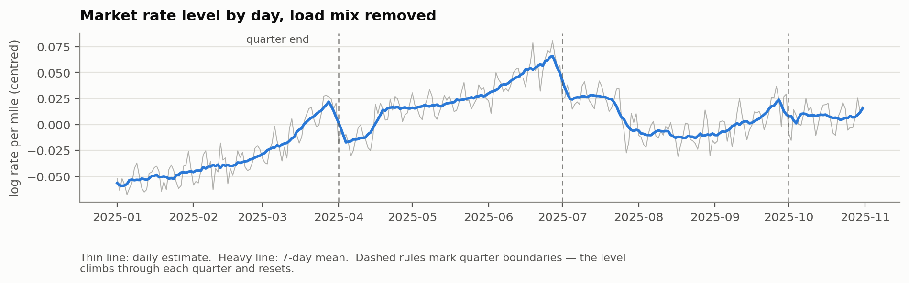
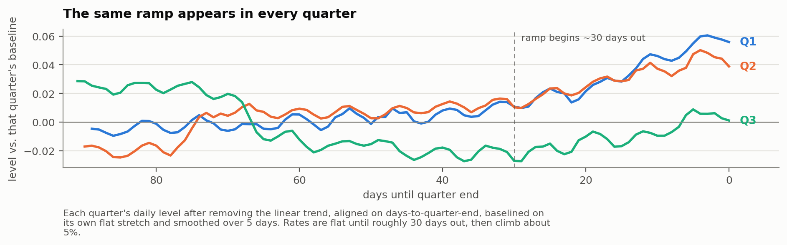
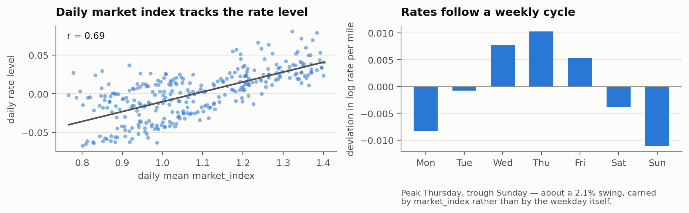
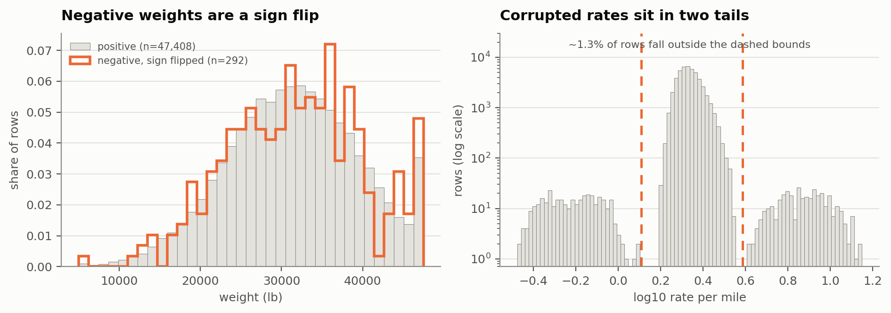
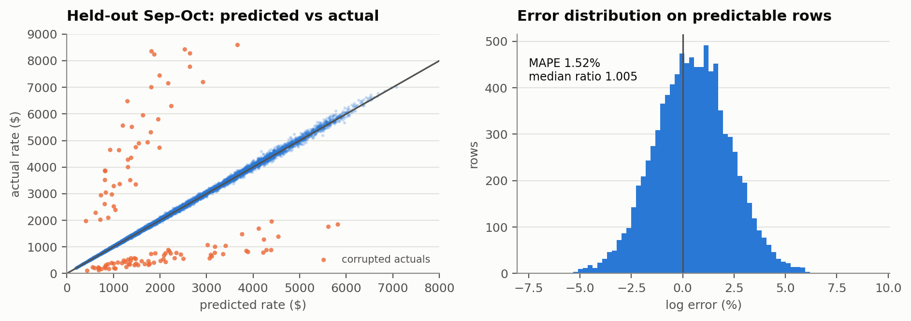
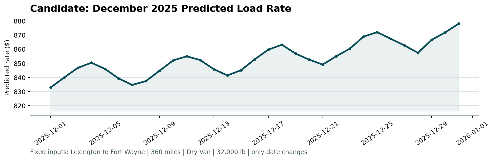

# Freight Rate Prediction

Machine Learning Engineer assessment. This report covers how I split the data, what
exploration turned up, the data-quality problems I found and what I did about them, the
model, and the December chart.

## 1. Summary

I predict `posted_rate` for all 12,000 validation loads with a two-stage model: a linear
stage over smooth, extrapolating features, plus a gradient-boosted correction fitted to
its residuals. The target is log rate-per-mile rather than the dollar rate.

On forward-in-time validation folds that reproduce the submission's forecast horizon, the
model lands at **1.58% mean absolute percentage error** on the rows that are actually
predictable, against a **1.35%** noise floor measured with a random split. Roughly 1.3% of
rows carry a corrupted `posted_rate` that no model can recover; those are reported
separately rather than being allowed to hide the rest.

The finding that mattered most is that the rate level is not flat over the calendar. It
climbs through each quarter and resets at the quarter boundary, rising about 5% over a
quarter's final month. December is a quarter-end month, so this drives the shape of the
required chart.

## 2. How I split the data

The two files are separated in time, not at random:

| File | Rows | Dates |
|---|---|---|
| `train_test.csv` | 48,000 | 2025-01-01 to 2025-10-31 |
| `validation.csv` | 12,000 | 2025-11-01 to 2025-12-31 |

Validation is one to two months past the end of the labelled data. That rules out a random
split for model selection. A random split lets the model see loads from the very days it is
scoring, and the daily market level is the single largest source of variation in the target,
so a random split would report an accuracy the submission cannot reproduce.

I used three forward-chaining folds instead. Each trains on everything before a cut date and
scores a contiguous one-to-two-month block after it:

| Fold | Trains on | Scores |
|---|---|---|
| 1 | before 2025-07-01 | 2025-07-01 to 2025-08-31 |
| 2 | before 2025-08-01 | 2025-08-01 to 2025-09-30 |
| 3 | before 2025-09-01 | 2025-09-01 to 2025-10-31 |

Fold 3 is the closest analogue to the real task: two months of unseen future, trained on
eight months of history. I still ran a random split, but only to measure the noise floor.
The gap between it and the temporal folds is what the forecast horizon costs, and reporting
it as a validation score would be misleading.

One thing the split does use is the validation covariates. `market_index` is supplied for
every validation row, and the daily average of it is the strongest single predictor of where
rates sit on a given date. Using it is not leakage, since it is a feature and not the label,
and it matches how the model would run in production, where today's market conditions are
known. The folds are built the same way so that the validation numbers are honest about it.

## 3. What exploration turned up

**Rate scales with distance, but less than proportionally.** The elasticity of total rate to
distance runs from about 0.85 at 300 miles to 0.89 at 2,500. Long hauls cost more in total
and less per mile. This is why I model log rate-per-mile and carry log distance as a feature:
it moves the dominant, nearly log-linear effect into a form the linear stage handles exactly,
instead of asking a tree to approximate a smooth slope with steps.

**Equipment carries a clean premium.** Against Dry Van, Reefer runs about 12.9% higher per
mile and Flatbed about 8.4%.

**Geography is latitude, not city identity.** Per-city effects correlate -0.84 with latitude:
southern origins and destinations price higher per mile, northern ones lower, at roughly
-0.34% per degree north on each end. Longitude does essentially nothing. This matters
practically, because validation introduces eight cities that never appear in training.

**The market level moves with the calendar.** After dividing out the load mix, the daily rate
level shows a clear sawtooth. It climbs through each quarter and drops at the quarter
boundary. Underneath that sits a steady upward drift of about 0.60% per month.

Aligning the three complete quarters on days-to-quarter-end shows the same shape each time:
flat until roughly 30 days out, then a climb of about 5%.

**`market_index` is the main date-level driver.** Its daily mean explains about 96% of the
day-to-day movement in the rate level once the trend and the quarter ramp are accounted for.
It also carries a weekly cycle, peaking Thursday and troughing Sunday, and rates follow it:
about a 2.1% swing across the week. The weekday itself adds almost nothing once the index is
in the model, so this is a market effect rather than a calendar effect.

**`quote_signal` is noise.** Its partial correlation with the target, after distance and the
market level, is 0.03. Including it made held-out accuracy measurably worse (1.75% against
1.58% MAPE), because the booster fits the noise. I dropped it.

## 4. Data quality

| Issue | Extent | What I did |
|---|---|---|
| Negative `weight` | 292 rows | Took the absolute value. The negative entries' magnitudes match the positive distribution exactly, same 5,000 to 47,500 bounds and near-identical quartiles, so the sign is corruption and not a code for something. |
| Corrupted `posted_rate` | ~1.3% of rows | Left in the file, excluded from fitting. They form two clean lobes at roughly 3.3x and 0.29x the true rate, well separated from the main body. The linear stage is fitted by iteratively reweighted least squares that trims beyond 4 robust standard deviations; 749 rows (1.56%) were dropped. |
| Missing `weight` | 300 train, 165 validation | Imputed with the training median, plus an explicit missingness flag so the model can price the uncertainty. |
| Missing `market_index` | 374 train, 249 validation | Filled from that date's mean. The daily level is what carries the signal, so a same-day fill loses very little. |
| Cities absent from training | 8 cities, 1,447 validation rows (12.1%) | Used latitude and longitude rather than city identity. A city-name encoding would have no value for an eighth of the validation set; coordinates generalise, and latitude is what the city effect actually tracks. |
| `distance` floored at 70 miles | 48 rows | Left alone. Short lanes are clipped to a 70-mile minimum, which looks like a billing floor rather than an error, and the model sees the same floor at prediction time. |

I also checked for duplicate `load_id`s and duplicate rows and found none. Each city maps to
exactly one coordinate pair, and pickup and delivery coordinates agree for every city. The
given `distance` correlates 0.9995 with great-circle distance between those coordinates, at a
ratio of about 1.18, which is a normal road-circuity factor. The coordinates are internally
consistent even though they do not match real-world US geography, so I treated them as a
valid synthetic geography and used them as-is.

## 5. Model

**Target.** Log rate-per-mile. Working in logs makes the multiplicative structure additive,
which is what the data shows: equipment, market level and geography all act as percentage
adjustments rather than dollar ones.

**Stage one, linear.** Least squares over log distance and its square, log weight, the daily
market level and the within-day deviation from it, pickup and delivery coordinates, equipment
indicators, a linear time index, and a hinge basis on days-to-quarter-end. Fitted robustly.

**Stage two, gradient boosting.** `HistGradientBoostingRegressor` fitted to the first stage's
residuals, over the same features minus the time index.

**Why split it this way.** Validation runs two months past the end of training, and the rate
level drifts upward the whole time. A tree cannot extrapolate that drift; past its last split
it repeats its final value, which would leave every November and December prediction short. A
linear term in the time index does extrapolate it. So the linear stage carries everything
smooth that has to run past the training window, and the booster only ever sees features whose
values in November and December fall inside the range it was trained on. Days-to-quarter-end,
day-of-week and day-of-month all satisfy that; raw month and day-of-year do not, and are
deliberately absent.

**Calibration.** I predict the conditional median in log space and exponentiate, without a
smearing correction. The corrupted rows inflate the mean of the actuals by about 1.3%, so
scaling predictions up would reduce raw bias but would roughly double the median error. For
any percentage or absolute error metric the uncorrected prediction is the right target.

## 6. Results

Forward-chaining folds. "Clean" columns exclude rows whose actual is more than 1.8x or less
than 0.6x the prediction, which is the corrupted population.

| Fold | Rows | MAE | RMSE | MAPE | MAE (clean) | RMSE (clean) | MAPE (clean) |
|---|---|---|---|---|---|---|---|
| 1: Jul-Aug | 9,671 | 92.77 | 618.41 | 4.05% | 40.66 | 58.07 | 1.75% |
| 2: Aug-Sep | 9,429 | 84.84 | 611.36 | 3.74% | 34.06 | 49.24 | 1.47% |
| 3: Sep-Oct | 9,523 | 91.85 | 629.80 | 4.05% | 35.74 | 51.83 | 1.52% |
| **Mean** | | **89.82** | **619.86** | **3.95%** | **36.82** | **53.05** | **1.58%** |

Random-split reference, not a validation estimate: 1.35% MAPE (clean), 31.95 MAE (clean).

The gap between the columns is the corrupted 1.3%. They move RMSE from 53 to 620 while
barely touching the clean error, which is why both are reported. The gap between 1.58% and
the 1.35% floor is what two months of forecast horizon costs, and it is small, which says the
calendar structure is being extrapolated correctly rather than guessed.

Errors are close to symmetric in log space with a median ratio of 1.005, so the model is not
systematically high or low. The final model was refitted on all 48,000 training rows.

## 7. December chart

Predictions rise from **$832.79 on 1 December to $878.09 on 31 December**, about 5.4% across
the month, or $2.31 to $2.44 per mile on a 360-mile Dry Van lane.

Two things drive the shape. The upward slope is the quarter-end ramp: December is the last
month of Q4, and the same climb appears in the final month of Q1, Q2 and Q3. The weekly
oscillation on top of it is the `market_index` cycle, peaking midweek and bottoming at the
weekend. Both are patterns measured in the training data rather than artefacts. I checked the
weekly wiggle specifically: the swing implied by the market index alone is about 2.1%, and the
model's is close to that, so it is not the model amplifying noise.

Because the chart inputs carry no `market_index`, the daily level for each December date is
taken from the validation file, which covers the same dates. The alternative was to hold the
index at a constant and show only the trend and the ramp. I preferred using the observed daily
level because it is the same information the model uses for the scored predictions, and a chart
built on a different basis than the submission would not represent the model being submitted.

## 8. Limitations

- **The trend is extrapolated on ten months of history.** A linear fit held up best out of
  sample (degree-2 and degree-3 fits were worse on held-out months), but with under a year of
  data I cannot separate a genuine secular trend from the slow arm of an annual cycle. If the
  drift is actually seasonal and turns over in Q4, December predictions are biased high.
- **The quarter-end ramp is estimated from three quarters.** The shape is consistent across
  all three, but the Q4 ramp is an out-of-sample assumption, and Q4 could behave differently
  because of holiday freight.
- **Corrupted rows cap the achievable score.** At about 1.3% of rows with roughly 3.3x and
  0.29x multipliers, they set a floor on RMSE no model can go below. If the scoring metric is
  RMSE on raw actuals, that term dominates and differences between reasonable models will be
  mostly invisible.
- **Eight validation cities are unseen.** Coordinates handle them, but Laredo sits at latitude
  25.5, below the training range that starts at 28.4, so those rows extrapolate the latitude
  effect rather than interpolating it.

With more time I would fit the quarter-end ramp as a monotone shape-constrained spline rather
than a hinge basis, and add quantile predictions so corrupted rows can be flagged rather than
only trimmed.
